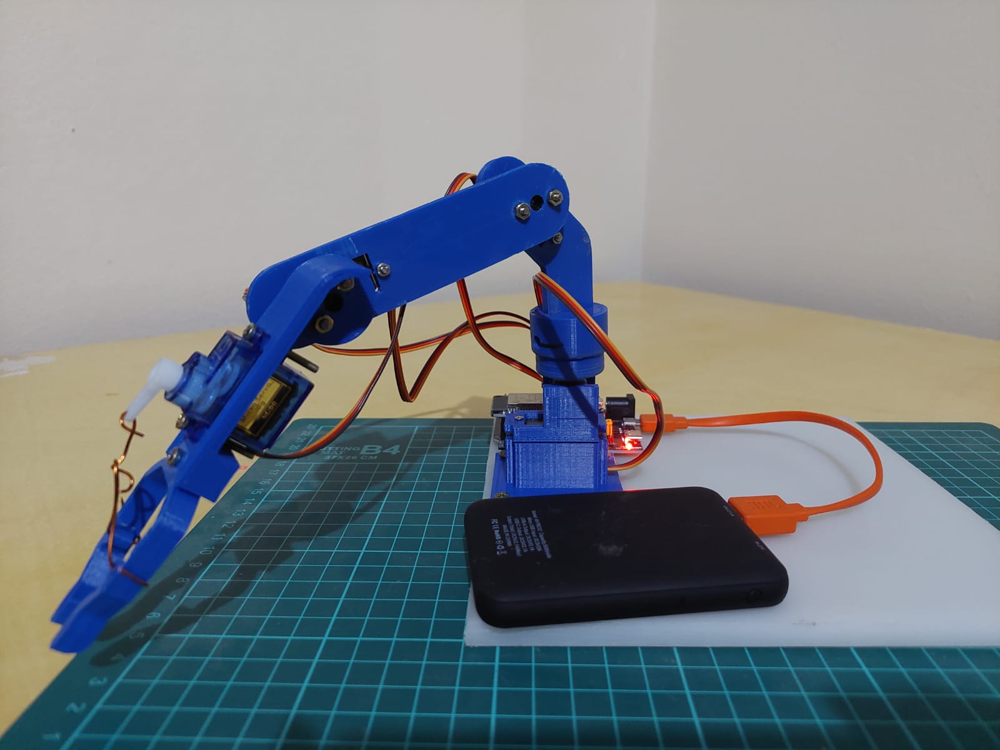
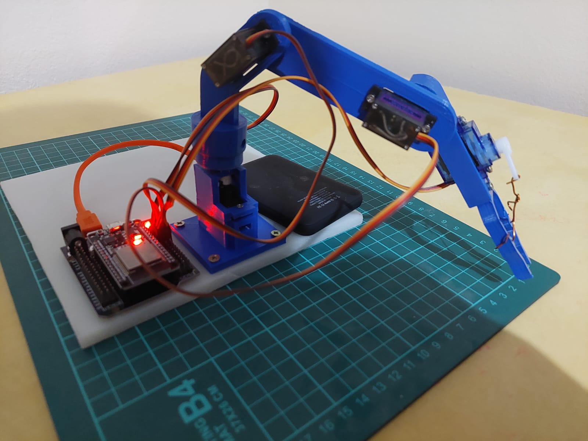
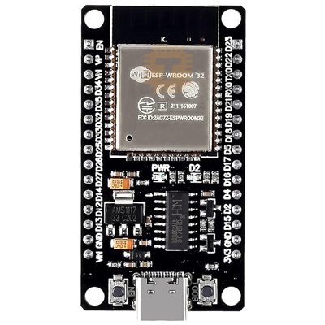
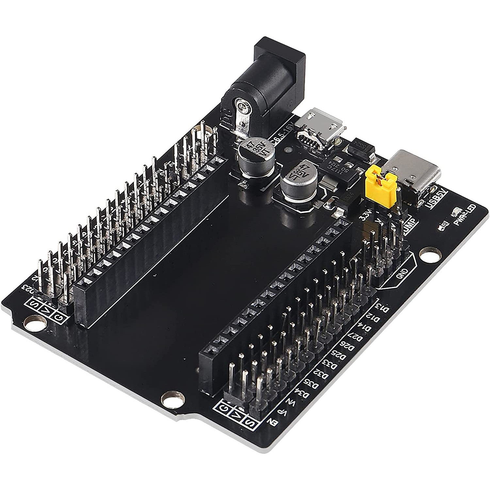
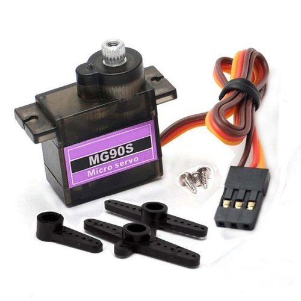
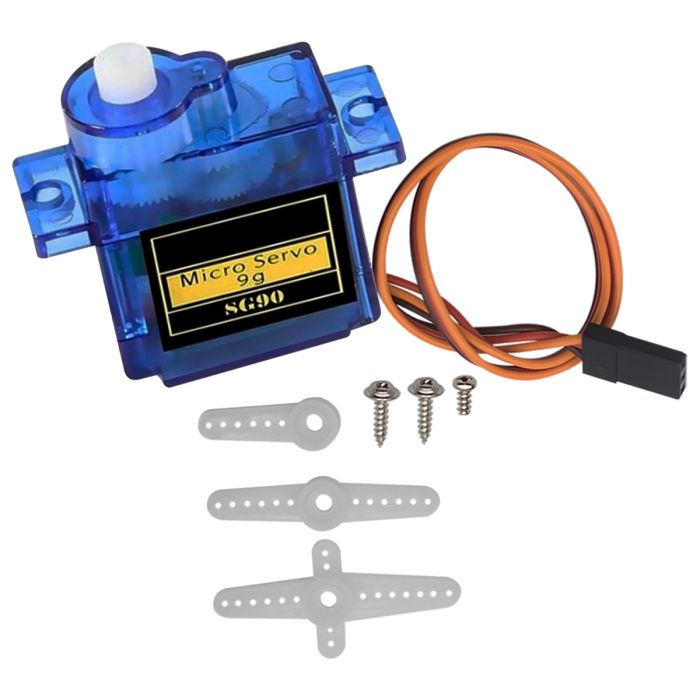
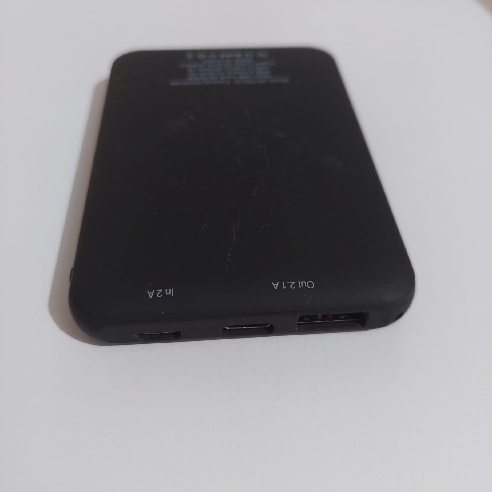
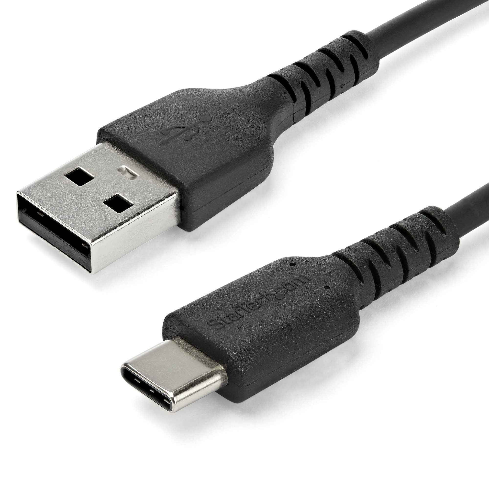
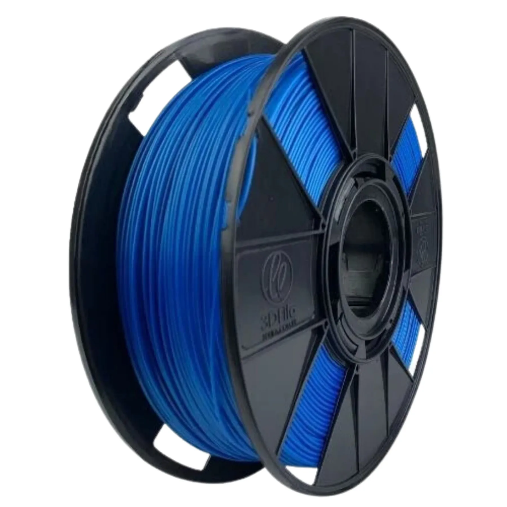

# `Arm/` – ESP32 Robotic Arm Controller

This folder contains the firmware and structural files for the robotic arm used in the **BitArm project** — a BLE-controlled, 3D-printed manipulator with three degrees of freedom and a claw. The arm is actuated by **three MG90S servos** (base, shoulder, elbow) and **one SG90 servo** (claw), all controlled by an **ESP32-DevKitC-32**.

To improve stability and reduce mechanical stress on the base motor, the structure includes a **ball bearing at the rotation axis**, allowing for smoother and more reliable movement.

Commands are sent via **Bluetooth Low Energy (BLE)** from a Raspberry Pi Pico W touchscreen interface. Each command corresponds to a predefined position or claw movement, and transitions are executed smoothly to reduce mechanical stress and improve precision.

The ESP32 is mounted on a **custom shield**, which distributes power and simplifies wiring. This folder includes the control firmware (`arm_controller.c`) and mechanical design files (in the `Structure/` subfolder).

<div align="center">
  <table>
    <tr>
      <td>
        
      </td>
      <td>
        
      </td>
    </tr>
  </table>
  <p><em>BitArm – Fully assembled robotic arm in idle position</em></p>
</div>

---

## Directory Tree

```bash
Arm/
├── arm_controller.c    # Firmware for ESP32 to control servos via BLE
├── Structure/          # STL files and images of the 3D-printed arm parts
├── Resources/          # Images used in documentation
└── README.md           # This file
```
---

## Bill of Materials

### Main Electronics

| Component               | Quantity | Description                                | Image |
|-------------------------|----------|--------------------------------------------|-------|
| ESP32-DevKitC-32        | 1x       | With CH340C USB-Serial converter            |  |
| ESP32S NodeMCU Shield   | 1x       | 30 pin ESP32 interface with power distribution        |  |
| MG90S Servo Motor       | 3x       | Metal gear servos (base, shoulder, elbow)  |  |
| SG90 Servo Motor        | 1x       | Claw actuation                             |  |
| Power Bank              | 1x       | 20000mAh / 22.5W, 5V output                 |  |
| USB-A to USB-C Cable    | 1x       | USB-A to USB-C for power                     |  |

---

### Arm Structure

| Component     | Quantity | Description                    | Image |
|---------------|----------|--------------------------------|-------|
| Printed Frame | 1x       | 3D-printed in PLA              |  |
| 608Zz Bearing | 1x       | For base axis smooth rotation |  |

---

### Screws and Fasteners

| Purpose               | Quantity | Specification                             |
|-----------------------|----------|-------------------------------------------|
| MG90S Mounting        | 6x       | M2 x 20mm flat head screws + M2 nuts      |
| Joint Supports + Claw | 8x       | M2.5 x 20mm pan head screws + M2.4 nuts   |
| Base Fixation         | 4x       | M4 x 10mm self-threading screws           |

---

## Power Supply

- The robotic arm requires a **5V power source** capable of delivering at least **2.5A** to operate safely and reliably.
- A **20000mAh / 22.5W USB power bank** is recommended for portability and stable current delivery. But an equivalent Lithium battery also can be used.
- **Do not power the ESP32 and servos via a computer USB port**, as it cannot supply sufficient current for all motors.
- The **custom ESP32 shield** ensures clean power distribution to all components, preventing voltage drops and unexpected resets during motion.

---

## 📡 Pin Mapping (ESP32 → Servos)

| Function      | GPIO (ESP32) | Description                        |
|---------------|--------------|------------------------------------|
| Base Servo    | 13           | Rotates the base (horizontal axis) |
| Shoulder      | 12           | Lifts the upper arm (vertical axis)|
| Elbow         | 14           | Moves the forearm (vertical axis)  |
| Claw Servo    | 27           | Opens and closes the claw          |

- **PWM Frequency:** 50 Hz  
- **PWM Resolution:** 16 bits  
- **Duty Cycle Mapping:** `1638` (0°) → `8192` (180°)

---

## BLE Command Protocol

The robotic arm receives commands via **Bluetooth Low Energy (BLE)** — a low-power wireless communication protocol commonly used in embedded and IoT devices.

Each command is sent as a single character and interpreted by the ESP32 as follows:

| Command | Action                        |
|---------|-------------------------------|
| `'0'`–`'7'` | Move to one of eight preset positions |
| `'8'`       | Open the claw (to 60°)               |
| `'9'`       | Close the claw (to 120°)             |

Servo transitions are performed smoothly to reduce mechanical stress and improve motion precision.

---

## How to Use

1. Open the `Arm/` folder in **PlatformIO**, using the **ESP32 DevKitC** environment.
2. Upload `arm_controller.c` to your ESP32 board.
3. Connect the ESP32 to a **5V power source** (e.g., power bank) via the custom shield.
4. On the Raspberry Pi Pico W, start the BLE interface and press the **“A” button** on the touchscreen.
5. Once connected, use the touch interface to send commands (`'0'`–`'9'`) to the arm.
6. The ESP32 receives the BLE command and moves the servos smoothly to the target position or claw state.

---

## Final Considerations

This robotic arm structure was inspired by the open-source design shared at [Thingiverse – Robotic Arm (MG90S based)](https://www.thingiverse.com/thing:1684471). While the **claw mechanism** was directly adapted from that model — with minor adjustments for fit and integration — the rest of the structure was designed in  Tinkercad, using the former [Thingiverse](https://www.thingiverse.com/thing:1684471) project as a reference to design pieces that suit the specific goals and constraints of this project.

One of the key structural improvements made in this design was the addition of a **608Zz ball bearing at the base**. This enhancement significantly reduces the mechanical load on the base servo motor, providing:

- **Smoother rotational motion**
- **Greater stability**
- **Reduced wear on the servo gear system**

The result is a more robust and precise base movement, especially useful in setups where the arm must rotate frequently or support added mass.
