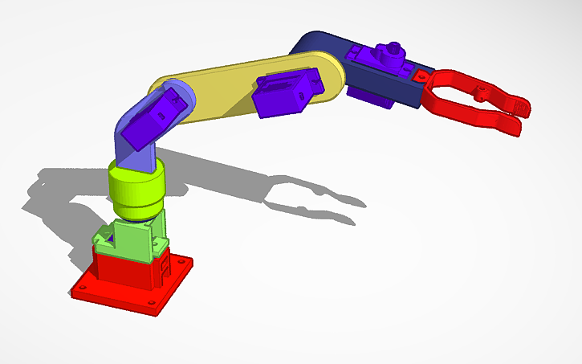
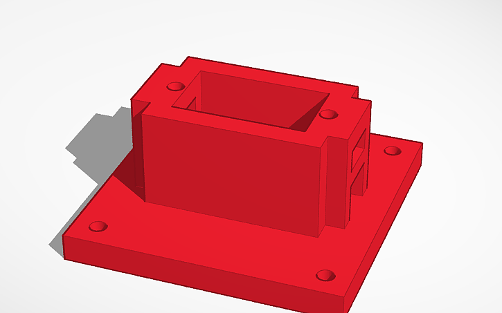
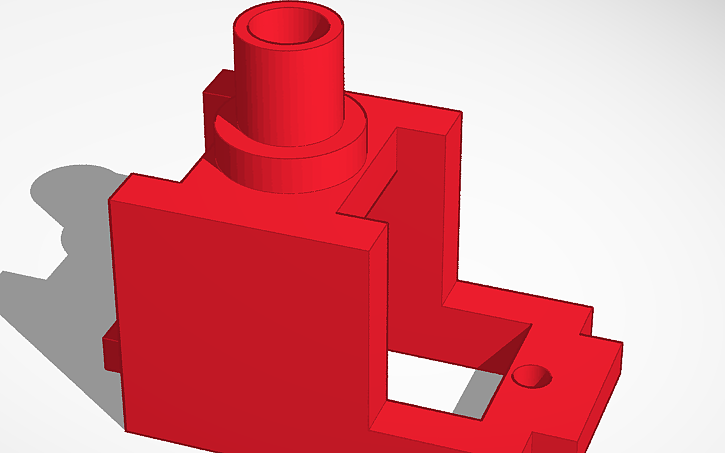
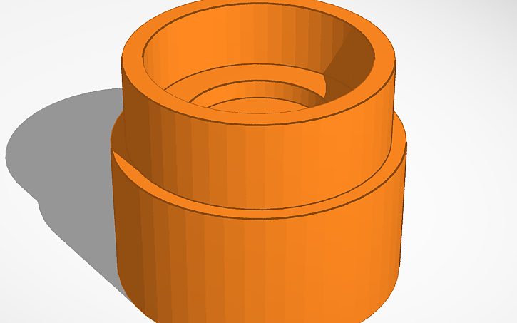
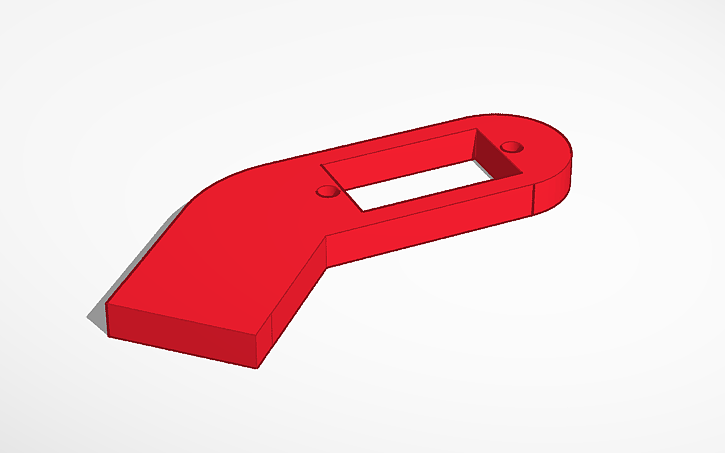
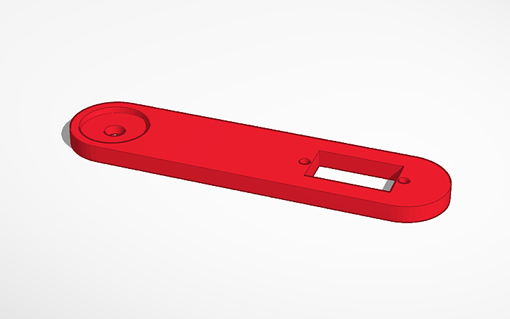
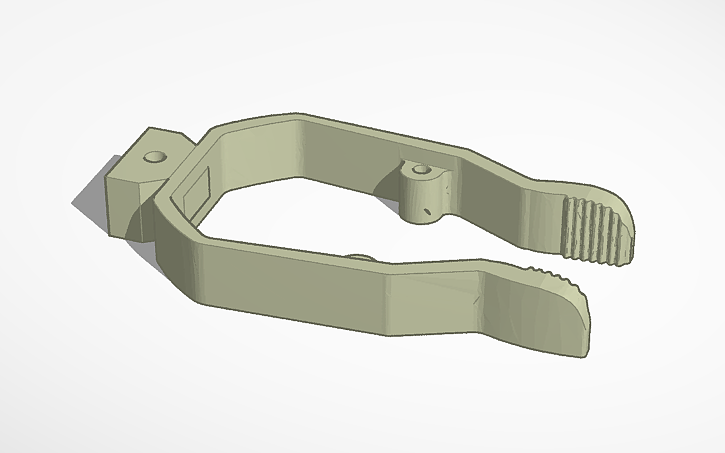

# `Structure/` – 3D-Printed Components for the Robotic Arm

This folder contains all STL files and documentation for the 3D-printed mechanical structure of the BitArm robotic arm. The entire model was designed in **Tinkercad**, with a focus on modularity, ease of assembly, and compatibility with MG90S and SG90 servo motors.

The design consists of **seven core components**: base motor mount, bearing support, rotating base, shoulder bracket, forearm, elbow, and claw; enabling **3 degrees of freedom** and **gripper functionality**. The parts were made to be fitted for standard metric fasteners M2 and M2.5.

---

## Assembled Overview

*Fully assembled BitArm exemple, with all printed modules connected*

---

## Components Overview

Each printed piece is described below with its purpose, assembly considerations, and STL filename.

---

### 1. Base Motor Cover  
**STL:** `Base Motor Cover.stl`

- Houses the **MG90S servo** responsible for horizontal base rotation.
- Includes holes for **M2 screws and nuts** to fasten the motor.
- Has a cable passthrough for neat wiring.
- Mounting holes at the bottom allow it to be fixed to a heavier base using **M2.5 screws**.

---

### 2. Ball Bearing Support  
**STL:** `Ball Bearing Support.stl`

- Goes between the motor and the bearing (608Zz).
- Ensures the **bearing is centered on the motor shaft**.
- Prevents external contact between the bearing and static structure.

---

### 3. Rotatory Base  
**STL:** `Rotatory Base.stl`

- Sits on top of the 608Zz bearing and rotates with the motor horn.
- Supports the shoulder structure (and by extent the whole arm).
- Includes a **rectangular cutout** to insert the next joint (shoulder).

---

### 4. Shoulder  
**STL:** `Shoulder.stl`

- Mounts the **second MG90S servo** (Upper Arm movement).
- Fixes onto the rotatory base and acts as the **first articulation joint**.

---

### 5. Upper Arm  
**STL:** `Upper Arm.stl`

- Connected to the shoulder via servo horn.
- Includes mount for the **third MG90S servo**, which actuates the elbow, articulating the Forearm.

---

### 6. Forearm  
**STL:** `Forearm.stl`

- Mounts onto the elbow servo, linked to the Upper Arm.
- Holds the **SG90 servo** used to open and close the claw.
- Features a back slot to insert and fasten the claw.

---

### 7. Claw  
**STL:** `Claw.stl`

- This part is a **direct adaptation** of the [gripper design available on Thingiverse](https://www.thingiverse.com/thing:1684471), modified slightly to fit this arm’s mechanical structure.
- Connected to the **SG90 servo**, it operates using a wire or string pulled by the servo horn to open and close.
- Includes two rear holes for mounting — can be clipped into the elbow or fixed with screws if needed.

## Printing and Assembly Notes

- All parts **above** were printed in **PLA**, with tolerances carefully adjusted for **tight press fits**.
- No glue is required — all parts **above** are either **screw-mounted** or **slot-fitted**.
- The **rotational axis** of the arm is currently implemented using **two metal screws linked together**:
  - One screw attaches directly to the **motor horn**, providing rotational drive.
  - The second screw passes **transversely through the Rotatory Base**, securing it to the Ball Bearing Support and enabling a stable, centered rotation.
- In future revisions, a **fully 3D-printable axle** will be included in this repository to simplify assembly and reduce dependency on external hardware.

**Recommended print settings:**
- Layer height: `0.2mm`
- Infill: `≥20%`
